# ScoreVision-MIDI

## Abstract

ScoreVision-MIDI is an optical music recognition system for full page GrandStaff piano score images. It reads a rendered score page and predicts a symbolic BEKRN/KERN style transcription that can be evaluated as text, inspected as music notation tokens, and rendered into simple audio for presentation demos.

The main completed experiments are two CTC score unfolding architectures: a CRNN decoder and a CNNT decoder. Both models use the same convolutional page encoder, the same GrandStaff BEKRN vocabulary, and the same CTC training objective. They differ in how the encoded page feature map is unfolded into a long symbolic sequence. The CRNN uses recurrent sequence modeling, while the CNNT uses transformer self attention over the unfolded page features. On the local GrandStaff full test split, the CNNT checkpoint is the stronger model, with lower CER, SER, and LER than the CRNN checkpoint.

The project includes the complete preprocessing path, distributed training scripts, checkpoint evaluation scripts, visual dataset summaries, training curve dashboards, and a notebook that reloads the trained weights, produces five example transcriptions, and synthesizes simple WAV demos from predicted KERN tokens.

## Score Demo

The demo files below come from the notebook output directory. Each input image is a GrandStaff score slice. The linked WAV files are simple sine wave renderings created from the predicted symbolic KERN tokens, so they are useful for presentation playback but are not a neural audio model.

| Example | Input score | CRNN prediction audio | CNNT prediction audio |
| ---: | --- | --- | --- |
| 0 | 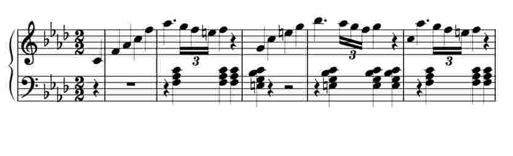 | [WAV](outputs/submission_notebook/five_test_examples/crnn/audio/example_0_crnn_prediction.wav) | [WAV](outputs/submission_notebook/five_test_examples/cnnt/audio/example_0_cnnt_prediction.wav) |
| 1 | 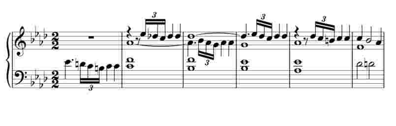 | [WAV](outputs/submission_notebook/five_test_examples/crnn/audio/example_1_crnn_prediction.wav) | [WAV](outputs/submission_notebook/five_test_examples/cnnt/audio/example_1_cnnt_prediction.wav) |
| 2 | 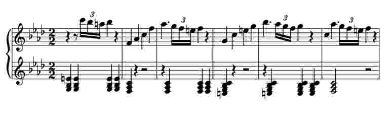 | [WAV](outputs/submission_notebook/five_test_examples/crnn/audio/example_2_crnn_prediction.wav) | [WAV](outputs/submission_notebook/five_test_examples/cnnt/audio/example_2_cnnt_prediction.wav) |
| 3 | 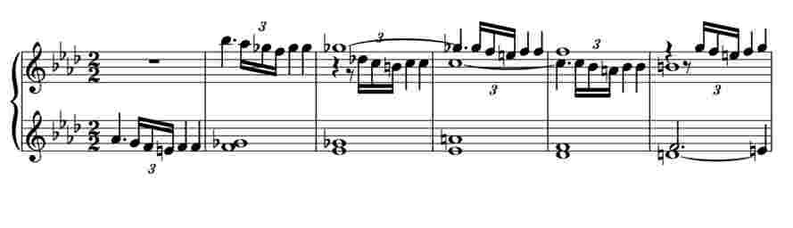 | [WAV](outputs/submission_notebook/five_test_examples/crnn/audio/example_3_crnn_prediction.wav) | [WAV](outputs/submission_notebook/five_test_examples/cnnt/audio/example_3_cnnt_prediction.wav) |
| 4 | 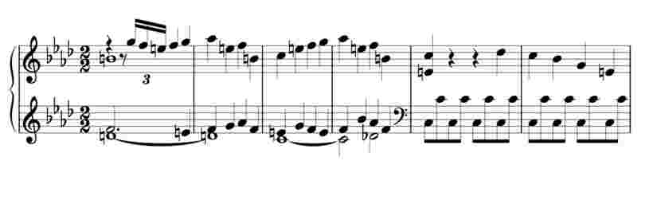 | [WAV](outputs/submission_notebook/five_test_examples/crnn/audio/example_4_crnn_prediction.wav) | [WAV](outputs/submission_notebook/five_test_examples/cnnt/audio/example_4_cnnt_prediction.wav) |

The symbolic files for the same examples are saved under:

```text
outputs/submission_notebook/five_test_examples/crnn/hyp
outputs/submission_notebook/five_test_examples/crnn/gt
outputs/submission_notebook/five_test_examples/cnnt/hyp
outputs/submission_notebook/five_test_examples/cnnt/gt
```

## Method

This section keeps the transcription task, preprocessing, model architecture, training objective, decoding, and evaluation math in one place.

### Problem Definition

For each GrandStaff example, let the score image be

$$ X_i \in [0, 1]^{1 \times H_i \times W_i} $$

and let the target BEKRN token sequence be

$$ y_i = [y_{i,1}, y_{i,2}, \ldots, y_{i,U_i}] $$

where each token belongs to the saved vocabulary:

$$ y_{i,u} \in \mathcal{V} $$

The CTC models learn an image conditioned symbolic transcription distribution:

$$ p_\theta(y \mid X) $$

The repository uses BEKRN/KERN text as the symbolic target. Spaces, tabs, and line breaks are preserved as explicit tokens:

$$ \text{space} \rightarrow \langle s \rangle $$

$$ \text{tab} \rightarrow \langle t \rangle $$

$$ \text{line break} \rightarrow \langle b \rangle $$

This matters because a music score is not just a stream of note names. The tab and line break structure preserves simultaneous spines, measures, voices, and line structure in the KERN style output.

### Image Preprocessing

The active CRNN and CNNT configs use clean GrandStaff images:

```text
load_distorted: false
resize_ratio: 1.0
image_cache_dir: outputs/image_cache/grandstaff_bekrn_plain
```

For each partition entry, preprocessing resolves a `.bekrn` transcription, reads the paired `.jpg` score image in grayscale, resizes it, rotates it 90 degrees clockwise, and stores the result as a cached `.npy` file. During training, the cached image is converted into a float tensor:

$$ X = image / 255 $$

Batch collation pads all images in the batch to the largest height and width in that batch. The CTC input length for one sample is computed from the cached image dimensions:

$$ T_{ctc} = \left\lfloor \frac{W}{8} \right\rfloor \left\lfloor \frac{H}{16} \right\rfloor $$

The constants come from the page encoder stride pattern: width is reduced by 8 and height is reduced by 16.

### Token Sequence Representation

The tokenizer turns raw BEKRN text into a list of tokens. Normal text symbols are kept as notation tokens, while structural whitespace becomes explicit control tokens. The inverse function turns decoded tokens back into KERN style text:

```text
utils/transcription.py
  bekern_text_to_tokens()
  tokens_to_kern()
```

The CTC vocabulary is saved under:

```text
outputs/vocab/grandstaff_bekrnw2i.npy
outputs/vocab/grandstaff_bekrni2w.npy
```

The loaded checkpoint metadata uses 188 vocabulary entries and adds one extra CTC blank class:

$$ |\mathcal{V}_{ctc}| = 188 $$

$$ C_{out} = |\mathcal{V}_{ctc}| + 1 = 189 $$

### Shared Page Encoder

Both CRNN and CNNT use the same convolutional `ScoreEncoder`. Given a padded image batch

$$ X \in \mathbb{R}^{B \times 1 \times H \times W} $$

the encoder produces a page feature tensor

$$ F = E_\psi(X) \in \mathbb{R}^{B \times 512 \times H' \times W'} $$

where

$$ H' = \left\lfloor H / 16 \right\rfloor $$

$$ W' = \left\lfloor W / 8 \right\rfloor $$

The encoder stack is:

| Block | Channels | Stride | Purpose |
| --- | ---: | ---: | --- |
| ConvBlock | 1 to 32 | 1 x 1 | first grayscale score features |
| ConvBlock | 32 to 64 | 2 x 2 | reduce page resolution |
| ConvBlock | 64 to 128 | 2 x 2 | increase local notation capacity |
| ConvBlock | 128 to 256 | 2 x 2 | deeper page features |
| ConvBlock | 256 to 512 | 2 x 1 | reduce height again while keeping more horizontal detail |
| 4 x DSCBlock | 512 to 512 | 1 x 1 | depth separable refinement at fixed encoded size |

The encoded feature map is then unfolded into a time sequence:

$$ S = [s_1, s_2, \ldots, s_T] $$

$$ T = H' W' $$

where each timestep contains a 512 dimensional page feature:

$$ s_t \in \mathbb{R}^{512} $$

This sequence is the input to the decoder. The CRNN and CNNT differ only after this shared page representation.

### CRNN Architecture

The CRNN model uses the shared encoder followed by recurrent score unfolding:

$$ F = E_\psi(X) $$

$$ S = flatten(F) \in \mathbb{R}^{B \times T \times 512} $$

The recurrent decoder reads the unfolded page sequence with a bidirectional LSTM:

$$ H^{crnn} = BiLSTM(S) $$

Then a linear classifier maps each timestep to token logits:

$$ Z^{crnn}_t = W_o H^{crnn}_t + b_o $$

$$ Z^{crnn} \in \mathbb{R}^{T \times B \times C_{out}} $$

Finally, log softmax gives the CTC frame distribution:

$$ P^{crnn}_{t,c} = logsoftmax(Z^{crnn}_{t,c}) $$

The CRNN is a strong baseline because recurrent layers process the unfolded score sequence in order and can model local symbolic continuity. Its weakness is that long full page dependencies must pass through recurrent state, which can make distant relations harder to preserve.

Active CRNN config and checkpoint:

```text
configs/score_unfolding.yaml
outputs/scorevision_grandstaff_bekrn_crnn_ddp_b12_bucketed/weights/best.pt
```

The best CRNN checkpoint is epoch 81:

| Item | Value |
| --- | ---: |
| Best epoch | 81 |
| Validation CER | 3.6329 |
| Validation SER | 5.8109 |
| Validation LER | 14.1089 |
| Checkpoint size | 153 MB |

### CNNT Architecture

The CNNT model uses the same encoded page sequence but replaces recurrent unfolding with transformer style sequence modeling:

$$ F = E_\psi(X) $$

$$ S = flatten(F) \in \mathbb{R}^{B \times T \times 512} $$

First, a positional encoding is added so the decoder knows where each feature came from in the unfolded page order:

$$ \tilde{S} = S + PE $$

The transformer decoder applies self attention over the full encoded page sequence:

$$ Q = \tilde{S}W_Q $$

$$ K = \tilde{S}W_K $$

$$ V = \tilde{S}W_V $$

$$ A = softmax(QK^T / \sqrt{d_k})V $$

Then the transformer output is projected to token logits:

$$ Z^{cnnt}_t = W_o H^{cnnt}_t + b_o $$

$$ P^{cnnt}_{t,c} = logsoftmax(Z^{cnnt}_{t,c}) $$

The advantage of CNNT is that self attention can connect distant encoded page positions directly. That is useful for full page optical music recognition, where clefs, key signatures, barlines, multi voice structure, and repeated rhythmic patterns can influence symbols far apart in the flattened sequence.

Active CNNT config and checkpoint:

```text
configs/score_unfolding_cnnt.yaml
outputs/scorevision_grandstaff_bekrn_cnnt_ddp_b2/weights/best.pt
```

The best CNNT checkpoint is epoch 70:

| Item | Value |
| --- | ---: |
| Best epoch | 70 |
| Validation CER | 3.2916 |
| Validation SER | 5.1627 |
| Validation LER | 11.6290 |
| Checkpoint size | 159 MB |

### CTC Training Objective

For both models, the decoder outputs a frame level distribution over the vocabulary plus the blank token. CTC is used because the model does not know the exact alignment between score image positions and target BEKRN tokens.

Let

$$ \pi = [\pi_1, \pi_2, \ldots, \pi_T] $$

be one frame level path, where each frame is either a vocabulary token or the blank symbol:

$$ \pi_t \in \mathcal{V} \cup \{\varnothing\} $$

The CTC collapse function removes repeated labels and blanks:

$$ B(\pi) = y $$

The probability of the target sequence is the sum over all paths that collapse to that target:

$$ p_\theta(y \mid X) = \sum_{\pi : B(\pi) = y} \prod_{t=1}^{T} p_\theta(\pi_t \mid X) $$

The training loss minimizes the negative log likelihood:

$$ \mathcal{L}_{ctc}(\theta) = -\log p_\theta(y \mid X) $$

In code, this is wrapped by:

```text
losses/ctc_loss.py
  CTCSequenceLoss
```

and implemented with:

```text
torch.nn.CTCLoss(blank=blank_idx)
```

### Greedy Decoding

At inference time, the model chooses the most likely class at every CTC timestep:

$$ \hat{\pi}_t = \arg\max_c p_\theta(c \mid X, t) $$

Then consecutive duplicates and blanks are removed:

$$ \hat{y} = B(\hat{\pi}) $$

The decoded token list is converted back to KERN style text and written as a `.krn` hypothesis file. The fresh full test evaluation writes one hypothesis and one ground truth file for every test sample.

### Evaluation Metrics

The repository reports three edit distance based metrics: CER, SER, and LER. All are normalized Levenshtein distances:

$$ error(A, B) = 100 \cdot \frac{Lev(A, B)}{|B|} $$

CER parses each transcription into a character level sequence. SER parses each transcription into symbol tokens. LER parses each transcription into line level entries.

| Metric | Unit | Interpretation |
| --- | --- | --- |
| CER | characters | low level text transcription accuracy |
| SER | BEKRN symbols | symbolic music token accuracy |
| LER | lines | stricter structure level agreement |

Lower is better for all three metrics.

## Output Gallery

### Dataset Overview

These panels document the exact GrandStaff dataset used by the CRNN and CNNT runs.

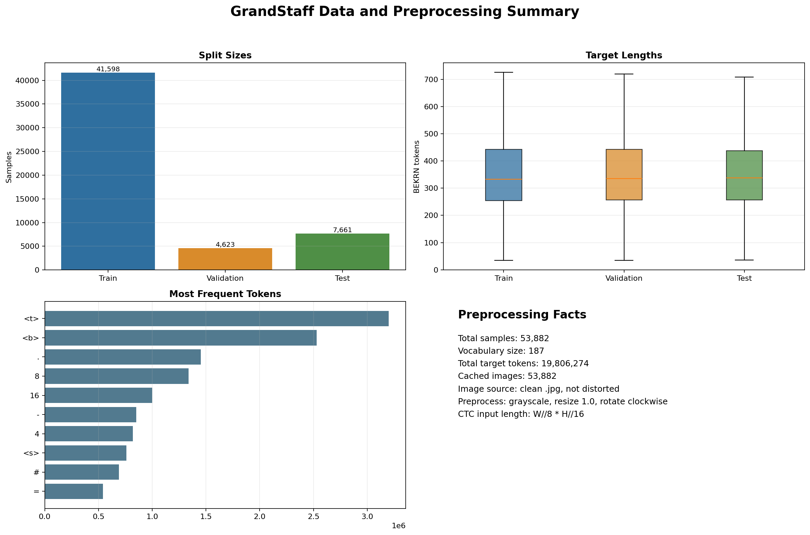

The dashboard summarizes the 53,882 local partition entries, cached model inputs, vocabulary size, token length distribution, and image shape distribution.

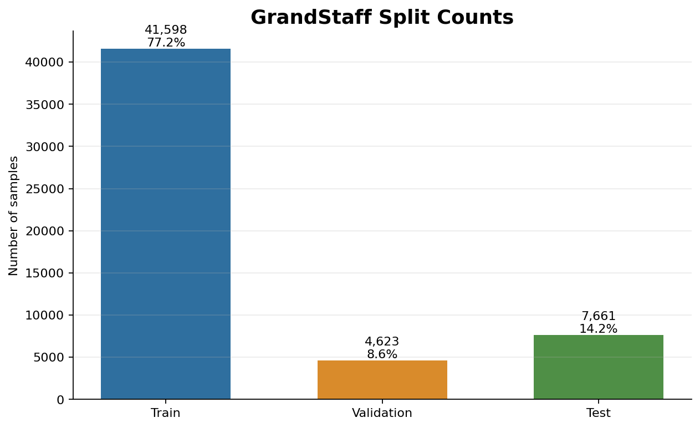

The split count panel shows the train, validation, and test partition sizes used by the completed experiments.

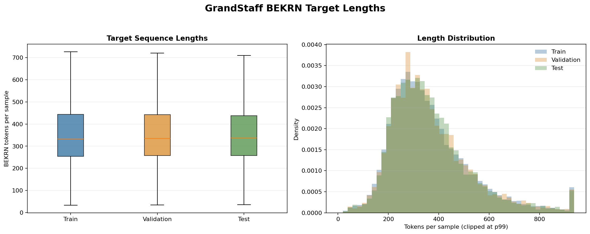

The token length panel shows that the task is long sequence transcription: median targets are about 334 tokens, and the longest target has 1,716 tokens.

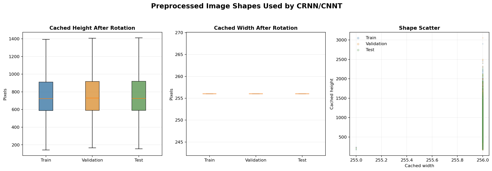

The image shape panel shows the cached rotated model inputs. Width is almost always 256 pixels after preprocessing, while height varies with score length.

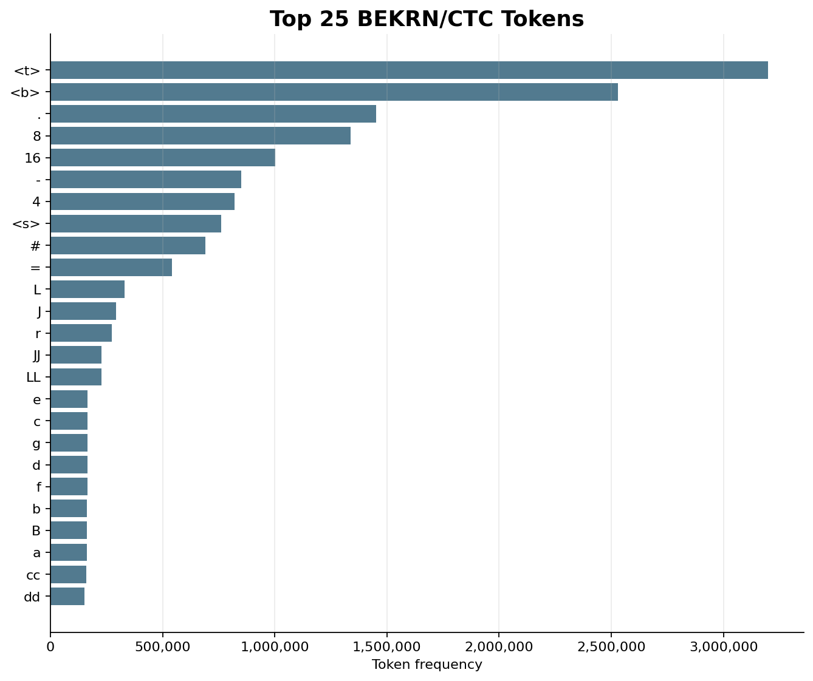

The token frequency panel shows how structural tokens, durations, rests, barlines, accidentals, and pitch symbols dominate the output vocabulary.

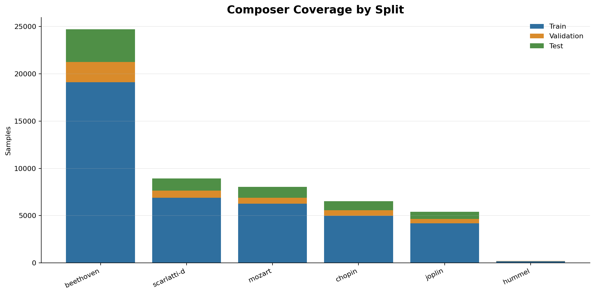

The composer panel shows the local GrandStaff composer coverage. Beethoven has the largest share, followed by Scarlatti, Mozart, Chopin, and Joplin.

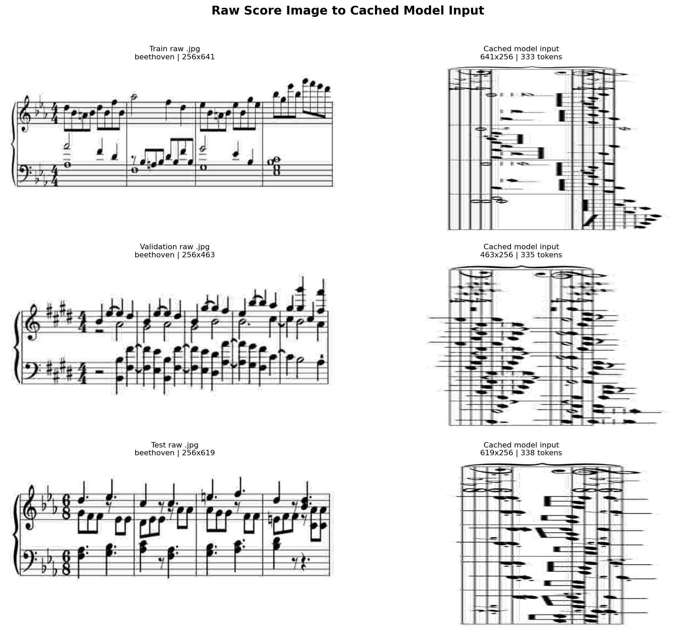

The examples panel shows raw score images beside their cached model inputs.

### Training Curves

These panels are generated from the real CRNN and CNNT training logs.

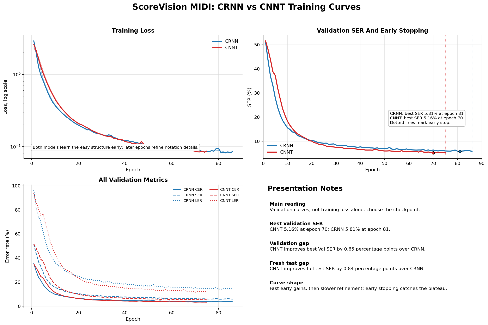

The training dashboard combines loss curves, validation SER, CER/SER/LER comparisons, best epochs, early stopping, and fresh full test SER.

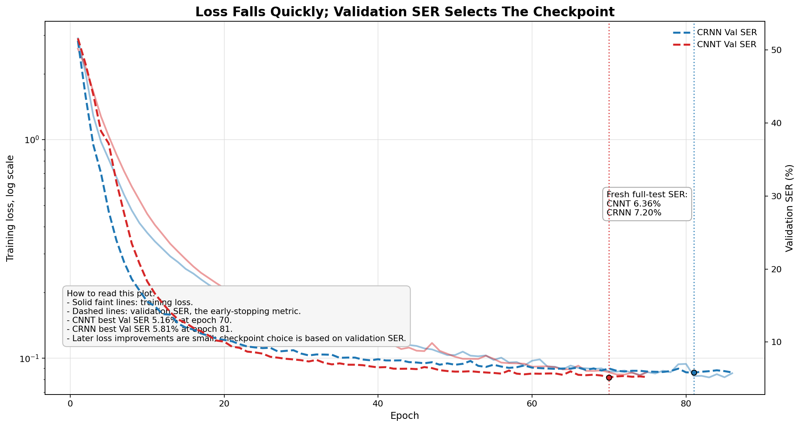

This plot shows why checkpoint selection uses validation SER rather than training loss alone. Both models continue refining loss, but validation SER identifies the useful best checkpoint.

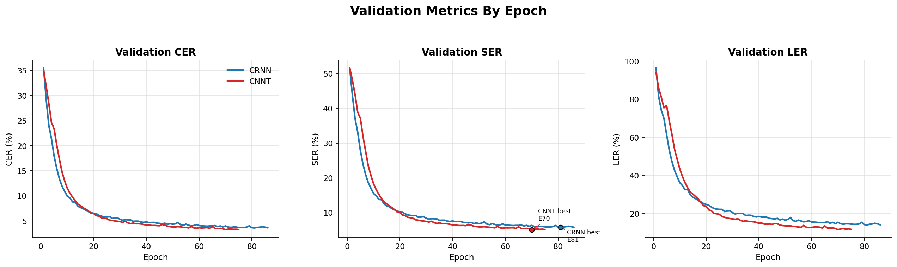

The validation metric panel compares CER, SER, and LER across epochs for CRNN and CNNT.

## Dataset And Preprocessing Summary

The active CTC dataset is the local GrandStaff split under:

```text
data/grandstaff_dataset
```

Partition files:

```text
data/grandstaff_dataset/partitions/train.txt
data/grandstaff_dataset/partitions/val.txt
data/grandstaff_dataset/partitions/test.txt
```

The generated preprocessing report found complete coverage: every partition entry has a transcription, clean image, distorted image file, and cached `.npy` input.

| Split | Samples | Cached NPY | Vocabulary | Median tokens | Token p95 | Max tokens | Median H | Median W |
| --- | ---: | ---: | ---: | ---: | ---: | ---: | ---: | ---: |
| Train | 41,598 | 41,598 | 185 | 333 | 684 | 1,716 | 723 | 256 |
| Validation | 4,623 | 4,623 | 170 | 335 | 683.80 | 1,676 | 730 | 256 |
| Test | 7,661 | 7,661 | 179 | 338 | 672 | 1,412 | 726 | 256 |
| Total | 53,882 | 53,882 | 187 | 334 | 682 | 1,716 | 724 | 256 |

Composer coverage:

| Composer | Train | Validation | Test | Total |
| --- | ---: | ---: | ---: | ---: |
| Beethoven | 19,123 | 2,130 | 3,467 | 24,720 |
| Scarlatti D | 6,875 | 776 | 1,286 | 8,937 |
| Mozart | 6,249 | 655 | 1,144 | 8,048 |
| Chopin | 4,995 | 585 | 955 | 6,535 |
| Joplin | 4,187 | 459 | 778 | 5,424 |
| Hummel | 169 | 18 | 31 | 218 |

## Architecture And Checkpoint Summary

| Model | Config | Decoder | Best epoch | Best validation SER | Fresh test SER | Checkpoint |
| --- | --- | --- | ---: | ---: | ---: | --- |
| CRNN | `configs/score_unfolding.yaml` | bidirectional recurrent unfolding | 81 | 5.8109 | 7.2036 | `outputs/scorevision_grandstaff_bekrn_crnn_ddp_b12_bucketed/weights/best.pt` |
| CNNT | `configs/score_unfolding_cnnt.yaml` | transformer unfolding | 70 | 5.1627 | 6.3623 | `outputs/scorevision_grandstaff_bekrn_cnnt_ddp_b2/weights/best.pt` |

Both models use:

- clean GrandStaff images
- cached grayscale `.npy` model inputs
- the same 188 entry CTC vocabulary
- the same CTC blank handling
- greedy CTC decoding for saved hypotheses
- early stopping on validation SER with patience 5

The CNNT model is stronger in the completed CTC comparison because it lowers both validation SER and full test SER.

## Training Results

Training curves are parsed from:

```text
logs/scorevision_grandstaff_bekrn_crnn_ddp_b12_bucketed_20260530_203444.log
logs/scorevision_grandstaff_bekrn_cnnt_ddp_b2_20260530_030814.log
```

| Model | Completed epochs | Best epoch | Final train loss | Best Val CER | Best Val SER | Best Val LER | Early stop epoch |
| --- | ---: | ---: | ---: | ---: | ---: | ---: | ---: |
| CRNN | 86 | 81 | 0.085350 | 3.6329 | 5.8109 | 14.1089 | 86 |
| CNNT | 75 | 70 | 0.086736 | 3.2916 | 5.1627 | 11.6290 | 75 |

The loss curves show both models learning the easy notation structure early. Later epochs mostly refine symbolic details. The best checkpoint is selected by validation SER, not by the lowest training loss.

## Evaluation Results

Fresh full test checkpoint evaluation reloads `best.pt`, evaluates all 7,661 GrandStaff test samples with batch size 1, and writes every prediction and reference to disk.

| Model | Source | Test samples | CER | SER | LER |
| --- | --- | ---: | ---: | ---: | ---: |
| CRNN | fresh checkpoint inference | 7,661 | 4.3678 | 7.2036 | 19.1032 |
| CNNT | fresh checkpoint inference | 7,661 | 3.9117 | 6.3623 | 16.3517 |

Training loop end of run evaluation:

| Model | Test CER | Test SER | Test LER |
| --- | ---: | ---: | ---: |
| CRNN | 4.2383 | 7.0236 | 18.6882 |
| CNNT | 3.8116 | 6.2293 | 16.0543 |

Five sample loaded weight inference:

| Model | Samples | CER | SER | LER |
| --- | ---: | ---: | ---: | ---: |
| CRNN | 5 | 5.6672 | 7.9030 | 23.1076 |
| CNNT | 5 | 3.7781 | 5.7903 | 20.7171 |

The fresh checkpoint table is the best table to cite for the completed CRNN versus CNNT comparison because it uses the same reload and full test protocol for both models.

## Notebook And Presentation Outputs

The submission notebook is:

```text
notebooks/scorevision_symbolic_conditioned_submission.ipynb
```

It performs these actions:

- locates the project root
- uses local CRNN/CNNT checkpoints or downloads external checkpoint links
- loads configs and vocabularies
- reports dataset and model information
- reloads the selected model
- runs five test examples
- writes predicted `.krn` files and ground truth `.krn` files
- renders simple WAV audio from the predicted KERN tokens

Notebook outputs:

```text
outputs/submission_notebook/five_test_examples
outputs/submission_notebook/loaded_weight_inference
```

The demo manifest is:

```text
outputs/submission_notebook/five_test_examples/demo_manifest.csv
```

## Setup

From the project root:

```bash
cd /mntdatalora/src/ScoreVision-MIDI
pip install -r requirements.txt
```

Core dependencies:

- `numpy`
- `opencv-python-headless`
- `Pillow`
- `PyYAML`
- `torch`
- `torchinfo`
- `transformers`
- `matplotlib`

For multi GPU training, use a PyTorch build that matches the local CUDA environment.

## Commands

Prepare the image cache:

```bash
python scripts/prepare_image_cache.py --config configs/score_unfolding.yaml
```

Train CRNN:

```bash
torchrun --standalone --nproc_per_node=2 \
  scripts/train_score_unfolding.py \
  --config configs/score_unfolding.yaml
```

Train CNNT:

```bash
torchrun --standalone --nproc_per_node=2 \
  scripts/train_score_unfolding.py \
  --config configs/score_unfolding_cnnt.yaml
```

Evaluate CRNN best checkpoint:

```bash
python evaluation/evaluate_ctc_checkpoint.py \
  --config configs/score_unfolding.yaml \
  --checkpoint outputs/scorevision_grandstaff_bekrn_crnn_ddp_b12_bucketed/weights/best.pt \
  --output-dir evaluation/runs/crnn_test
```

Evaluate CNNT best checkpoint:

```bash
python evaluation/evaluate_ctc_checkpoint.py \
  --config configs/score_unfolding_cnnt.yaml \
  --checkpoint outputs/scorevision_grandstaff_bekrn_cnnt_ddp_b2/weights/best.pt \
  --output-dir evaluation/runs/cnnt_test
```

Regenerate dataset visualisations:

```bash
python visualiser/analyse_grandstaff_data.py --workers 16
```

Regenerate training curve visualisations:

```bash
python visualiser/plot_training_curves.py
```

## Code Organization

```text
configs/             YAML configs for CRNN, CNNT, and experimental autoregressive runs
evaluation/          Checkpoint evaluation scripts, metric reports, and prediction runs
execution_scripts/   Shell launchers for distributed training
losses/              CTC and sequence cross entropy loss wrappers
models/              High level model definitions
modules/             Encoder, decoder, convolution, and positional encoding modules
notebooks/           Submission notebook and generated demo workflow
outputs/             Checkpoints, cached images, predictions, plots, reports, and demos
scripts/             Training, cache preparation, and timing CLIs
utils/               Data loading, tokenization, decoding, metrics, logging, and config helpers
visualiser/          Dataset and training curve visualization scripts
```

## Additional Autoregressive Checkpoint

The repository also contains an experimental ConvNeXt autoregressive transcription run. It is not the main CRNN/CNNT comparison, because it uses a different vocabulary, sequence loss, and generation protocol. The validated local checkpoint is:

```text
outputs/scorevision_grandstaff_bekrn_ar_convnext_scratch_ddp2_b16/weights/best.pt
```

Checkpoint metadata:

| Model | Best epoch | Validation CER | Validation SER | Validation LER |
| --- | ---: | ---: | ---: | ---: |
| ConvNeXt autoregressive | 60 | 1.9191 | 2.6941 | 6.3495 |

The `latest.pt` file for that run is an unvalidated epoch 65 step checkpoint, so `best.pt` is the checkpoint to cite.

## License

This project is released under the MIT License.

Copyright (c) 2026 Varun Moparthi

See [LICENSE](LICENSE) for the full license text.
